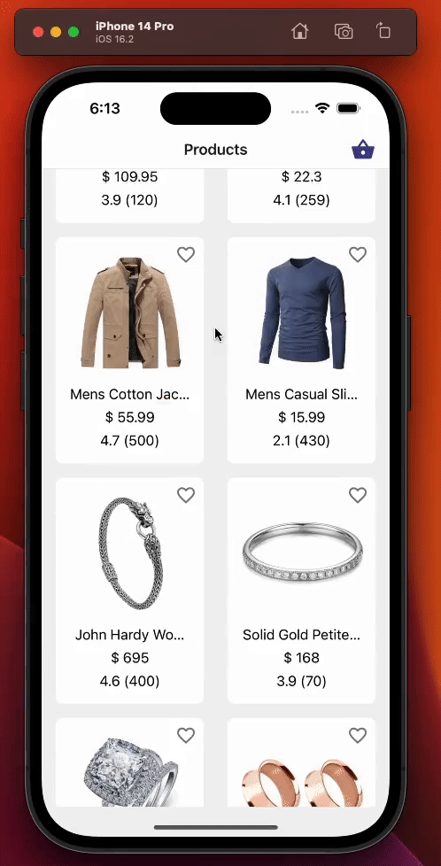
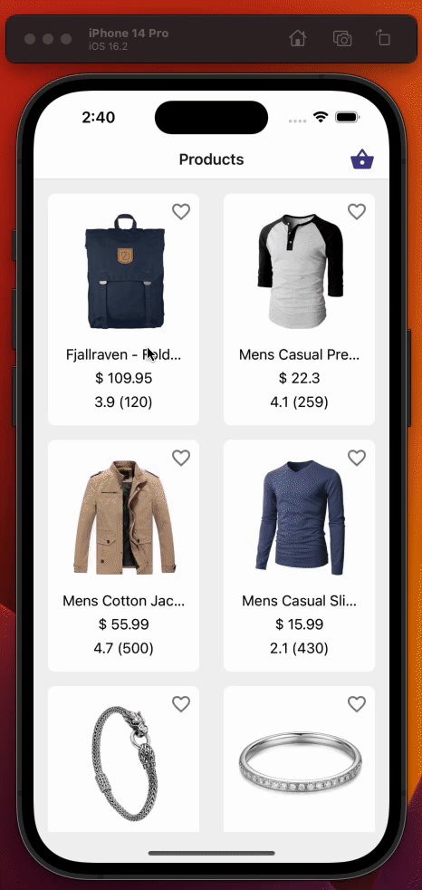
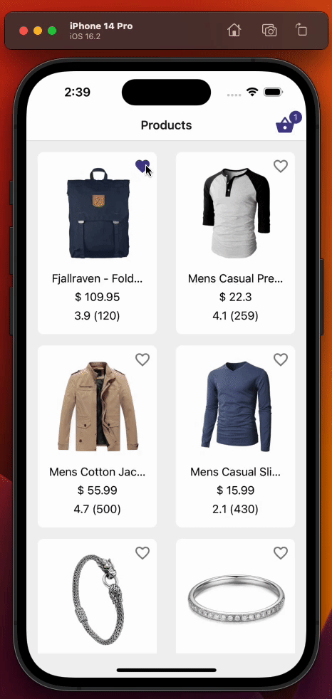
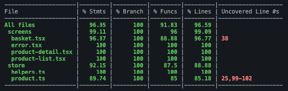

<div align="center"><h1>🧪 React Native Testing 🛠️ </h1></div> 


This app is a simple example of how to use/test React-Query for data fetching and Zustand for state management in a React Native application.

It provides comprehensive and detailed examples to aid in the understanding of the testing process. The app uses following core packages: 

- react (18.2.0)
- react-native (0.71.2, new arch.)
- jest (29.4.1)
- ts-jest (29.0.5)
- @testing-library/react-hooks (8.0.1)
- @testing-library/react-native (11.5.1)
- msw (1.0.0)


## ❓ I don't get why this repo exists 

To have better context about the repo, you can start by reading this [compherensive article.](https://medium.com/gitconnected/testing-react-native-with-react-query-and-zustand-d957c2a40b73)

## 📚 Table of contents 

*  [💻 Running locally](#-running-locally)
*  [🧪 Running tests](#-running-tests)
*  [👀 Overview of product list screen](#-overview-of-product-list-screen)
*  [👀 Overview of product detail screen](#-overview-of-product-detail-screen)
*  [👀 Overview of basket screen](#-overview-of-basket-screen)
*  [🧪 Coverage](#-coverage)
*  [🤖 E2E Testing with Detox](#-e2e-testing-with-detox)
*  [🐞 Known issues](#-known-issues)


## 💻 Running locally

Install dependencies

```bash
  yarn install
  ```

Start the emulator for ios.

```bash
 cd ios && pod install && yarn run ios
```

or for android

```bash
  yarn run android
```


## 🧪 Running tests

```bash
  yarn test
  ```
  
---
  
## 👀 Overview of product list screen




  
<details><summary>Code - Testing product list screen</summary>


```js
import {NavigationContainer} from '@react-navigation/native';
import {renderHook} from '@testing-library/react-hooks';
import {fireEvent, render, screen} from '@testing-library/react-native';
import React from 'react';
import {setupGetAllProductsFailedHandler} from '../../../__mocks__/msw/handlers';
import {useGetAllProducts} from '../../api/product';
import ProductStack from '../../navigation/product-stack';
import {RouteNames} from '../../navigation/route-names';
import {useProductStore} from '../../store/product';
import {createReactQueryWrapper} from '../../utils/testing';
import ProductListScreen from '../product-list';

// We render the whole app stack instead of rendering just the screen
// because we need access to the react-navigation's header, which wouldn't
// be possible if we just rendered the screen.
const rootAppComponent = (
  <NavigationContainer>
    <ProductStack />
  </NavigationContainer>
);
const navigateMock = jest.fn();
const navigation = {navigate: navigateMock} as any;
const route = jest.fn() as any;

const component = <ProductListScreen navigation={navigation} route={route} />;

describe('Product list screen', () => {
  it('should display loading indicator initially', async () => {
    // We render the component and expect to see a loading indicator
    render(component, {wrapper: createReactQueryWrapper});
    expect(screen.queryByTestId(`screen-loader`)).toBeTruthy();

    // We render the product list using useGetAllProducts hook and wait until the products are loaded
    const {result, waitFor} = renderHook(() => useGetAllProducts(), {
      wrapper: createReactQueryWrapper,
    });
    await waitFor(() => result.current.isSuccess);

    // We expect the loading indicator to disappear after the products are loaded
    expect(screen.queryByTestId(`screen-loader`)).not.toBeTruthy();
  });

  it('should display product list data correctly', async () => {
    // Render the component and wait for it to load
    render(component, {wrapper: createReactQueryWrapper});

    // Check that no product card is rendered before fetching data
    expect(screen.queryByTestId(`product-list-card-1`)).not.toBeTruthy();

    // Fetch the product data
    const {result, waitFor} = renderHook(() => useGetAllProducts(), {
      wrapper: createReactQueryWrapper,
    });

    // Wait for the data to be fetched successfully
    await waitFor(() => result.current.isSuccess);

    // Check that each product card is rendered for each product in the data
    for (const {id} of result.current.data!) {
      expect(screen.queryByTestId(`product-list-card-${id}`)).toBeTruthy();
    }
  });

  it('should display error text in case get all products query fails', async () => {
    // Set up the mock handler for GET requests to the /products endpoint that returns an error response
    setupGetAllProductsFailedHandler();

    // Render the ProductListScreen component wrapped in the React Query wrapper
    render(component, {wrapper: createReactQueryWrapper});

    // Set up a mock React hook that calls the useGetAllProducts hook from the API module
    const {result, waitFor} = renderHook(() => useGetAllProducts(), {
      wrapper: createReactQueryWrapper,
    });

    // Wait for the useGetAllProducts hook to throw an error
    await waitFor(() => result.current.isError);

    // Assert that the "An error occurred" text is displayed on the screen
    expect(screen.getByText(`An error occurred`)).toBeTruthy();
  });

  it('should call navigation action on pressing the first product item', async () => {
    // Render the ProductListScreen component along with react-query wrapper
    render(component, {wrapper: createReactQueryWrapper});

    // Render the useGetAllProducts hook with react-query wrapper to fetch data
    const {result, waitFor} = renderHook(() => useGetAllProducts(), {
      wrapper: createReactQueryWrapper,
    });

    // Wait for the data to be fetched
    await waitFor(() => result.current.isSuccess);

    // Find the first product card in the list and simulate a press event on it
    const firstProductItem = screen.getByTestId(`product-list-card-1`);
    fireEvent.press(firstProductItem);

    // Expect that the navigation function is called with the correct route name and params
    expect(navigateMock).toHaveBeenCalledWith(RouteNames.productDetail, {
      id: 1,
    });
  });

  it('should add/remove product item correctly on pressing product items basket icon', async () => {
    // We render the entire app stack and use the createReactQueryWrapper as a
    // wrapper for the render function to set up the React Query Provider.
    render(rootAppComponent, {
      wrapper: createReactQueryWrapper,
    });

    // We use the renderHook function to invoke the useGetAllProducts hook which
    // fetches the data.
    const {result, waitFor} = renderHook(() => useGetAllProducts(), {
      wrapper: createReactQueryWrapper,
    });

    // We use the renderHook function to get access to the useProductStore hook
    // which we will use to check that the products in the basket were added/removed correctly.
    const {result: productStore} = renderHook(() => useProductStore(), {
      wrapper: createReactQueryWrapper,
    });

    // We wait for the useGetAllProducts hook to complete fetching the data before proceeding
    // with the test.
    await waitFor(() => result.current.isSuccess);

    // We get the basket button for the first product item using the getByTestId function.
    const firstProductItemBasketButton = screen.getByTestId(`basket-button-1`);

    // We click the basket button for the first product item.
    fireEvent.press(firstProductItemBasketButton);

    // We check that the basket icon quantity text is present using the getByTestId function.
    expect(screen.getByTestId('basket-icon-quantity-text-1')).toBeTruthy();

    // We check that the products in the basket have been added correctly using the productStore.
    expect(productStore.current.productsInBasket).toHaveLength(1);
    expect(productStore.current.productsInBasket[0].quantity).toBe(1);
    expect(productStore.current.productsInBasket[0].product).toMatchObject(
      result.current.data![0],
    );

    // We click the basket button for the first product item again to remove it from the basket.
    fireEvent.press(firstProductItemBasketButton);

    // We check that the basket icon quantity text is not present.
    expect(
      screen.queryByTestId('basket-icon-quantity-text-1'),
    ).not.toBeTruthy();

    // We check that the products in the basket have been removed correctly using the productStore.
    expect(productStore.current.productsInBasket).toHaveLength(0);
  });
});

```

</details>

## 👀 Overview of product detail screen




<details><summary>Code - Testing product detail screen</summary>

```js
import {renderHook} from '@testing-library/react-hooks';
import {fireEvent, render, screen} from '@testing-library/react-native';
import React from 'react';
import {ProductDetailScreen} from '..';
import {setupGetProductByIdFailedHandler} from '../../../__mocks__/msw/handlers';
import {useGetProductById} from '../../api/product';
import {RouteNames} from '../../navigation/route-names';
import {useProductInBasketQuantityById} from '../../store/product';
import {cutString} from '../../utils/cut-string';
import {getPriceText} from '../../utils/get-price-text';
import {createReactQueryWrapper} from '../../utils/testing';

const increaseProductQuantityInBasketMock = jest.fn();
const decreaseProductQuantityInBasketMock = jest.fn();
const addProductToBasketMock = jest.fn();
const removeProductFromBasketMock = jest.fn();

jest.mock('../../store/product', () => ({
  useProductActions: () => ({
    increaseProductQuantityInBasket: increaseProductQuantityInBasketMock,
    decreaseProductQuantityInBasket: decreaseProductQuantityInBasketMock,
    addProductToBasket: addProductToBasketMock,
    removeProductFromBasket: removeProductFromBasketMock,
  }),
  useProductInBasketQuantityById: jest.fn(() => undefined),
}));

const navigateMock = jest.fn();
const setOptionsMock = jest.fn();
const navigation = {navigate: navigateMock, setOptions: setOptionsMock} as any;
const productId = 1;
const route = {params: {id: productId}} as any;

const component = <ProductDetailScreen navigation={navigation} route={route} />;

describe('Product detail screen', () => {
  it('should display loading indicator on mount', async () => {
    render(component, {wrapper: createReactQueryWrapper});

    expect(screen.queryByTestId(`screen-loader`)).toBeTruthy();

    const {result, waitFor} = renderHook(() => useGetProductById(productId), {
      wrapper: createReactQueryWrapper,
    });

    await waitFor(() => result.current.isSuccess);
  });

  it('should display product detail data correctly, and should set header title based on api data', async () => {
    // we need to render whole app stack in order to be able to get header title
    render(component, {
      wrapper: createReactQueryWrapper,
    });

    const {result, waitFor: waitForHook} = renderHook(
      () => useGetProductById(productId),
      {
        wrapper: createReactQueryWrapper,
      },
    );

    await waitForHook(() => result.current.isSuccess);

    expect(setOptionsMock).toHaveBeenCalledWith({
      headerTitle: cutString(result.current.data!.title),
    });

    expect(screen.getByTestId(`product-detail-scroll-view`)).toBeTruthy();

    expect(screen.getByTestId('product-detail-image').props.source.uri).toBe(
      result.current.data!.image,
    );

    expect(screen.getByText(result.current.data!.title)).toBeTruthy();

    expect(screen.getByText(result.current.data!.description)).toBeTruthy();
  });

  it('should display error text in case get all products query fails', async () => {
    setupGetProductByIdFailedHandler();

    render(component, {wrapper: createReactQueryWrapper});

    const {result, waitFor} = renderHook(() => useGetProductById(productId), {
      wrapper: createReactQueryWrapper,
    });

    await waitFor(() => result.current.isError);

    expect(screen.getByText(`An error occurred`)).toBeTruthy();
  });

  it('should display price and quantity of the item correctly', async () => {
    render(component, {
      wrapper: createReactQueryWrapper,
    });

    const {result, waitFor: waitForHook} = renderHook(
      () => useGetProductById(productId),
      {
        wrapper: createReactQueryWrapper,
      },
    );

    await waitForHook(() => result.current.isSuccess);

    expect(screen.getByTestId(`product-detail-price`).props.children).toBe(
      getPriceText(result.current.data!.price),
    );

    expect(
      screen.getByTestId(
        `quantity-toggler-value-${result.current.data?.id.toString()}`,
      ).props.children,
    ).toBe('0');
  });

  it('should have decrease quantity button disabled and should call addFavoriteProduct function in case product has not been added to basket yet', async () => {
    render(component, {
      wrapper: createReactQueryWrapper,
    });

    const {result, waitFor: waitForHook} = renderHook(
      () => useGetProductById(productId),
      {
        wrapper: createReactQueryWrapper,
      },
    );

    await waitForHook(() => result.current.isSuccess);

    const increaseBtn = screen.getByTestId(
      `increase-quantity-btn-${result.current.data?.id.toString()}`,
    );
    const decreaseBtn = screen.getByTestId(
      `decrease-quantity-btn-${result.current.data?.id.toString()}`,
    );

    fireEvent.press(decreaseBtn);

    // decrease quantity button should be disabled if quantity equals to 0
    expect(decreaseProductQuantityInBasketMock).not.toHaveBeenCalled();

    fireEvent.press(increaseBtn);

    expect(addProductToBasketMock).toHaveBeenCalledWith(result.current.data!);
  });

  it('should increase quantity on pressing increase button in case product has already been added to basket', async () => {
    // product has been added to the basket
    (useProductInBasketQuantityById as jest.Mock).mockImplementation(() => 1);

    render(component, {
      wrapper: createReactQueryWrapper,
    });

    const {result, waitFor: waitForHook} = renderHook(
      () => useGetProductById(productId),
      {
        wrapper: createReactQueryWrapper,
      },
    );

    await waitForHook(() => result.current.isSuccess);

    const increaseBtn = screen.getByTestId(
      `increase-quantity-btn-${result.current.data?.id.toString()}`,
    );

    fireEvent.press(increaseBtn);

    expect(increaseProductQuantityInBasketMock).toHaveBeenCalledWith(
      result.current.data!.id,
    );
  });

  it('should call remove favorited product on pressing decrease button in case product has already been added to basket and its quantity equals to 1', async () => {
    // product has been added to the basket
    (useProductInBasketQuantityById as jest.Mock).mockImplementation(() => 1);

    render(component, {
      wrapper: createReactQueryWrapper,
    });

    const {result, waitFor: waitForHook} = renderHook(
      () => useGetProductById(productId),
      {
        wrapper: createReactQueryWrapper,
      },
    );

    await waitForHook(() => result.current.isSuccess);

    const decreaseBtn = screen.getByTestId(
      `decrease-quantity-btn-${result.current.data?.id.toString()}`,
    );

    fireEvent.press(decreaseBtn);

    expect(removeProductFromBasketMock).toHaveBeenCalledWith(
      result.current.data!.id,
    );
  });

  it('should call decrease favorited product on pressing decrease button in case product has already been added to basket and its quantity greater than 1', async () => {
    // product has been added to the basket and has quantity greater than 1
    (useProductInBasketQuantityById as jest.Mock).mockImplementation(() => 2);

    render(component, {
      wrapper: createReactQueryWrapper,
    });

    const {result, waitFor: waitForHook} = renderHook(
      () => useGetProductById(productId),
      {
        wrapper: createReactQueryWrapper,
      },
    );

    await waitForHook(() => result.current.isSuccess);

    const decreaseBtn = screen.getByTestId(
      `decrease-quantity-btn-${result.current.data?.id.toString()}`,
    );

    fireEvent.press(decreaseBtn);

    expect(decreaseProductQuantityInBasketMock).toHaveBeenCalledWith(
      result.current.data!.id,
    );
  });

  it('should call navigation function with correct params on pressing Go To Basket button', async () => {
    render(component, {
      wrapper: createReactQueryWrapper,
    });

    const {result, waitFor: waitForHook} = renderHook(
      () => useGetProductById(productId),
      {
        wrapper: createReactQueryWrapper,
      },
    );

    await waitForHook(() => result.current.isSuccess);

    const goToBasketBtn = screen.getByText('Go to basket');

    fireEvent.press(goToBasketBtn);

    expect(navigateMock).toHaveBeenCalledWith(RouteNames.basket);
  });
});
```

</details>

## 👀 Overview of basket screen




<details><summary>Code - Testing basket screen</summary>

```js

import {
  fireEvent,
  render,
  screen,
  waitFor,
} from '@testing-library/react-native';
import React from 'react';
import {GET_ALL_PRODUCTS_MOCK_RESPONSE} from '../../../__mocks__/msw/mock-data';
import {useProductsInBasket} from '../../store/product';
import {getBasketTotalPrice} from '../../utils/get-basket-total-price';
import {createReactQueryWrapper} from '../../utils/testing';
import BasketScreen from '../basket';

const increaseProductQuantityInBasketMock = jest.fn();
const decreaseProductQuantityInBasketMock = jest.fn();
const addProductToBasketMock = jest.fn();
const removeProductFromBasketMock = jest.fn();

const favoritedProducts = GET_ALL_PRODUCTS_MOCK_RESPONSE.map(product => ({
  product,
  quantity: Math.floor(Math.random() * 10) + 1,
}));

jest.mock('../../store/product', () => ({
  useProductActions: () => ({
    increaseProductQuantityInBasket: increaseProductQuantityInBasketMock,
    decreaseProductQuantityInBasket: decreaseProductQuantityInBasketMock,
    addProductToBasket: addProductToBasketMock,
    removeProductFromBasket: removeProductFromBasketMock,
  }),
  useProductsInBasket: jest.fn(),
}));

const navigateMock = jest.fn();
const setOptionsMock = jest.fn();
const navigation = {navigate: navigateMock, setOptions: setOptionsMock} as any;
const route = jest.fn() as any;

const component = <BasketScreen navigation={navigation} route={route} />;

describe('Basket screen', () => {
  it('should display all basket list data correctly', async () => {
    (useProductsInBasket as jest.Mock).mockImplementation(
      () => favoritedProducts,
    );

    render(component, {wrapper: createReactQueryWrapper});

    const eventData = {
      nativeEvent: {
        contentOffset: {
          y: 500,
        },
        contentSize: {
          height: 500,
          width: 100,
        },
        layoutMeasurement: {
          height: 100,
          width: 100,
        },
      },
    };

    // first 10 item will be visible on initial render
    for (const {
      product: {id},
    } of favoritedProducts.slice(0, favoritedProducts.length / 2)) {
      expect(await screen.getByTestId(`basket-card-${id}`)).toBeTruthy();
    }

    // scroll down to render remaining items
    fireEvent.scroll(screen.getByTestId('basket-screen-flat-list'), eventData);

    await waitFor(async () => {
      for (const {
        product: {id},
      } of favoritedProducts.slice(10, favoritedProducts.length)) {
        expect(await screen.getByTestId(`basket-card-${id}`)).toBeTruthy();
      }
    });
  });

  it('should set navigation header right component if there is at least one item in the basket', async () => {
    (useProductsInBasket as jest.Mock).mockImplementation(
      () => favoritedProducts,
    );

    render(component, {wrapper: createReactQueryWrapper});

    expect(setOptionsMock).toHaveBeenCalled();
  });

  it('should display basket total price correctly', async () => {
    render(component, {wrapper: createReactQueryWrapper});

    expect(
      screen.findByText(`$ ${getBasketTotalPrice(favoritedProducts)}`),
    ).toBeTruthy();
  });

  it('should not display basket total price when there is no items in the basket', async () => {
    (useProductsInBasket as jest.Mock).mockImplementation(() => []);

    render(component, {wrapper: createReactQueryWrapper});

    expect(
      screen.queryByText(`$ ${getBasketTotalPrice(favoritedProducts)}`),
    ).not.toBeTruthy();
  });

  it('should display empty basket when there is no item in the basket', async () => {
    (useProductsInBasket as jest.Mock).mockImplementation(() => []);

    render(component, {wrapper: createReactQueryWrapper});

    expect(screen.findByText(`Your basket is empty`)).toBeTruthy();
  });

  it('should increase quantity on pressing increase button', async () => {
    (useProductsInBasket as jest.Mock).mockImplementation(
      () => favoritedProducts,
    );

    render(component, {wrapper: createReactQueryWrapper});

    fireEvent.press(screen.getByTestId(`increase-quantity-btn-1`));

    expect(increaseProductQuantityInBasketMock).toHaveBeenCalledWith(
      favoritedProducts[0].product.id,
    );
  });

  it('should remove the product from the basket if quantity of the product equals to 1', async () => {
    (useProductsInBasket as jest.Mock).mockImplementation(() =>
      favoritedProducts.map(favoritedProduct => {
        // set first product quantity to 1
        if (favoritedProduct.product.id === 1) {
          return {
            ...favoritedProduct,
            product: favoritedProduct.product,
            quantity: 1,
          };
        }
        return favoritedProduct;
      }),
    );

    render(component, {wrapper: createReactQueryWrapper});

    fireEvent.press(screen.getByTestId(`decrease-quantity-btn-1`));

    expect(removeProductFromBasketMock).toHaveBeenCalledWith(
      favoritedProducts[0].product.id,
    );
  });

  it('should decrease the quantity of the product if its greater than 1', async () => {
    (useProductsInBasket as jest.Mock).mockImplementation(() =>
      favoritedProducts.map(favoritedProduct => {
        // set first product quantity to 2
        if (favoritedProduct.product.id === 1) {
          return {
            ...favoritedProduct,
            product: favoritedProduct.product,
            quantity: 2,
          };
        }
        return favoritedProduct;
      }),
    );

    render(component, {wrapper: createReactQueryWrapper});

    fireEvent.press(screen.getByTestId(`decrease-quantity-btn-1`));

    expect(decreaseProductQuantityInBasketMock).toHaveBeenCalledWith(
      favoritedProducts[0].product.id,
    );
  });
});

```


</details>


## 🧪 Coverage 




## 🤖 E2E Testing with Detox

### Android 

https://user-images.githubusercontent.com/61876765/221006794-2ea6791f-c6fb-46b7-b6da-39164eea64a4.mp4


<details><summary>Testing complete app flow</summary>

```js
describe('Example', () => {
  beforeAll(async () => {
    await device.launchApp({
      newInstance: true,
    });
  });

  beforeEach(async () => {
    await device.reloadReactNative();
  });

  test('complete app flow', async () => {
    // wait for product flat list to be visible with timeout of 6000ms
    // 6000ms can vary depending on the network, since we fetch the data from https://fakestoreapi.com
    // and server might not be stable all the time
    await waitFor(element(by.id('product-list-flat-list')))
      .toBeVisible()
      .withTimeout(6000);

    // it expects first product list card to be visible
    await expect(element(by.id('product-list-card-1'))).toBeVisible();

    // scroll to the end of the product list
    await element(by.id('product-list-flat-list')).scrollTo('bottom');

    // it expects last item of the product list to be visible after scrolling to the bottom
    await expect(element(by.id('product-list-card-20'))).toBeVisible();

    // scroll to top of the product list
    await element(by.id('product-list-flat-list')).scrollTo('top');

    // tap heart button of the first product list item in order to add product to the basket
    await element(by.id('basket-button-1')).tap();

    // tap heart button of the third product list item in order to add product to the basket
    await element(by.id('basket-button-3')).tap();

    // tap basket icon in order to navigate to basket screen
    await element(by.id('basket-icon')).tap();

    // it expects basket card of first product to be visible
    await waitFor(element(by.id('basket-card-1')))
      .toBeVisible()
      .withTimeout(1000);

    // it expects basket card of third product to be visible
    await expect(element(by.id('basket-card-3'))).toBeVisible();

    // increase quantity of the first product item by tapping + button in basket screen
    await element(by.id('increase-quantity-btn-1')).tap();

    // increase quantity of the first product item by tapping + button in basket screen
    await element(by.id('increase-quantity-btn-1')).tap();

    // it expects first product's quantity toggler component to have text of 3
    // since it has been added in product list with count of 1, and its quantity is increased by 2 in the basket screen/above
    await expect(element(by.id('quantity-toggler-value-1'))).toHaveText('3');

    // decrease first product quantity
    await element(by.id('decrease-quantity-btn-1')).tap();

    // it expects first product's quantity toggler component to have text of 2 since it is decreased by 1 above
    await expect(element(by.id('quantity-toggler-value-1'))).toHaveText('2');

    // increase quantity of the third product item by tapping + button in basket screen
    await element(by.id('increase-quantity-btn-3')).tap();

    // increase quantity of the third product item by tapping + button in basket screen
    await element(by.id('increase-quantity-btn-3')).tap();

    // it expects third product's quantity toggler component to have text of 3
    await expect(element(by.id('quantity-toggler-value-3'))).toHaveText('3');

    // decrease quantity of the third product item by tapping - button in basket screen
    await element(by.id('decrease-quantity-btn-3')).tap();

    // decrease quantity of the third product item by tapping - button in basket screen
    await element(by.id('decrease-quantity-btn-3')).tap();

    // decrease quantity of the third product item by tapping - button in basket screen
    await element(by.id('decrease-quantity-btn-3')).tap();

    // third product item is removed from the basket since its quantity its decreased by 3 times above
    await waitFor(element(by.id('basket-card-3')))
      .not.toBeVisible()
      .withTimeout(1000);

    // tap basket screen delete icon in the header right
    await element(by.id('basket-delete-icon')).tap();

    // it expects your basket is empty text to be visible after tapping basket delete icon
    await waitFor(element(by.text('Your basket is empty')))
      .toBeVisible()
      .withTimeout(1000);

    // tap basket screen header left to navigate back
    await element(by.id('basket-screen-header-left-btn')).tap();

    // it expects fourth product list item to be visible
    await waitFor(element(by.id('product-list-card-4')))
      .toBeVisible()
      .withTimeout(700);

    // tap fourth product list item
    await element(by.id('product-list-card-4')).tap();

    // it expects product detail image to be visible after tapping to the product item
    await waitFor(element(by.id('product-detail-image')))
      .toBeVisible()
      .withTimeout(700);

    // tap twice to increase quantity of fourth product item in product detail screen
    await element(by.id('increase-quantity-btn-4')).tap();
    await element(by.id('increase-quantity-btn-4')).tap();

    // it expects fourth product's quantity toggler component to have text of 1
    await expect(element(by.id('quantity-toggler-value-4'))).toHaveText('2');

    // tap to decrease quantity of fourth product item in product detail screen
    await element(by.id('decrease-quantity-btn-4')).tap();

    // it expects fourth product's quantity toggler component to have text of 1
    await expect(element(by.id('quantity-toggler-value-4'))).toHaveText('1');

    // tap go to basket button in order to navigate to basket screen from product detail screen
    await element(by.id('product-detail-go-to-basket-btn')).tap();

    // it expects fourth product item basket card to be visible since it has been added to the basket in above
    await waitFor(element(by.id('basket-card-4')))
      .toBeVisible()
      .withTimeout(1000);

    // it expects fourth product's quantity toggler component to have text of 1 in the basket screen
    await expect(element(by.id('quantity-toggler-value-4'))).toHaveText('1');
  });
});


```


</details>


## 🐞 Known issues 
- [e2e test with detox fails in iOS](https://github.com/wix/Detox/issues/3949)
  
  
